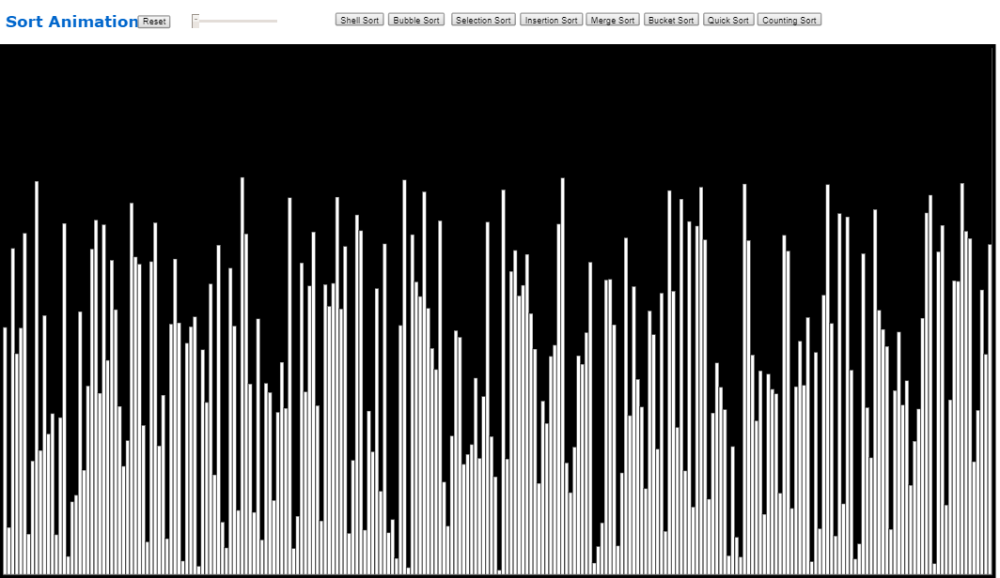
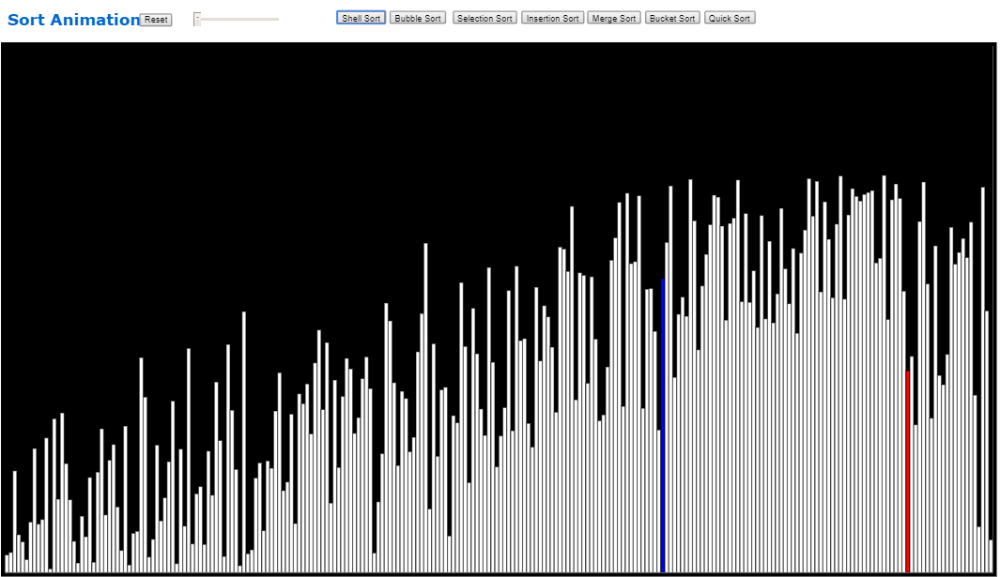
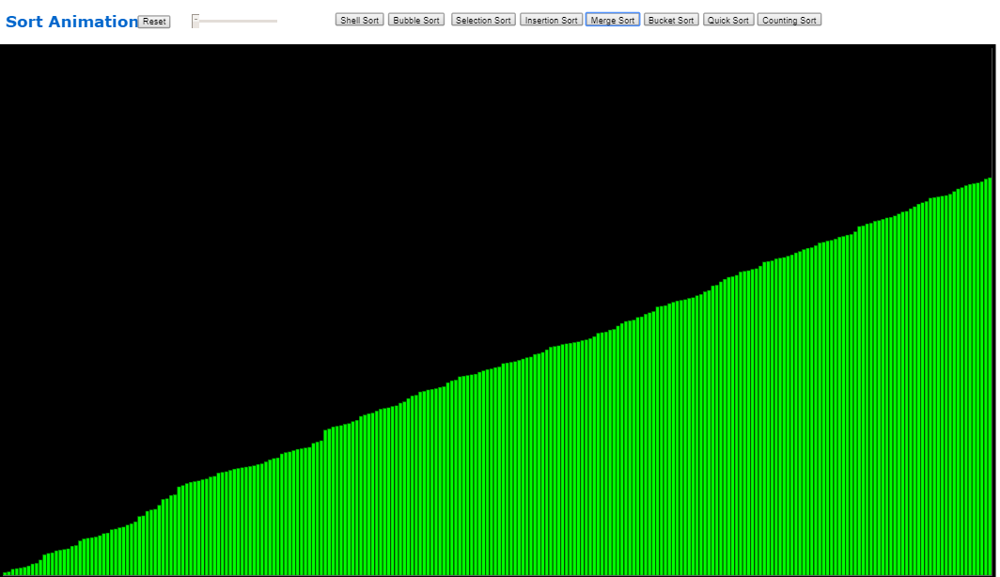

# Repositório Template
Repositório de Template para os projetos da disciplina 

## Alunos  
| Matrícula | Nome |  
|-----------------------|---------------------|  
| 16/0117003 | Daniel Maike Mendes Gonçalves |  
| 16/0121817 | Gabriela Medeiros da Silva |  
## Descrição do projeto
Esse projeto permite a visualização de algorítmos com várias complexidades, além dos que possuem complexidade nlogn. Há também a opção de alteração da velocidade das iterações realizadas em cada algorítmo. 

Os algorítimos que podem ser visualizados são:

- Shell Sort
- Bubble Sort
- Selection Sort
- Insertion Sort
- Merge Sort
- Bucket Sort
- Quick Sort
- Counting Sort

## Guia de instalação

### Dependências do projeto
Não há dependências
### Como executar o projeto
Para executar o programa, basta entrar nesse [link](https://edaii.github.io/Ord_nlogn_SortAnimations/), gerado com o mesmo código disponível nesse repositório.
## Capturas de tela

## Conclusões
O projeto é uma ótima solução para aprender e ensinar algorítmos de forma visual e didática, mostrando as modificações dos elementos a cada iteração.
